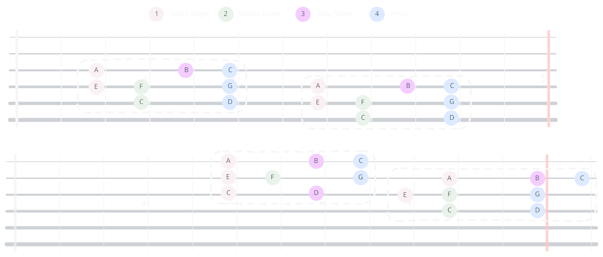
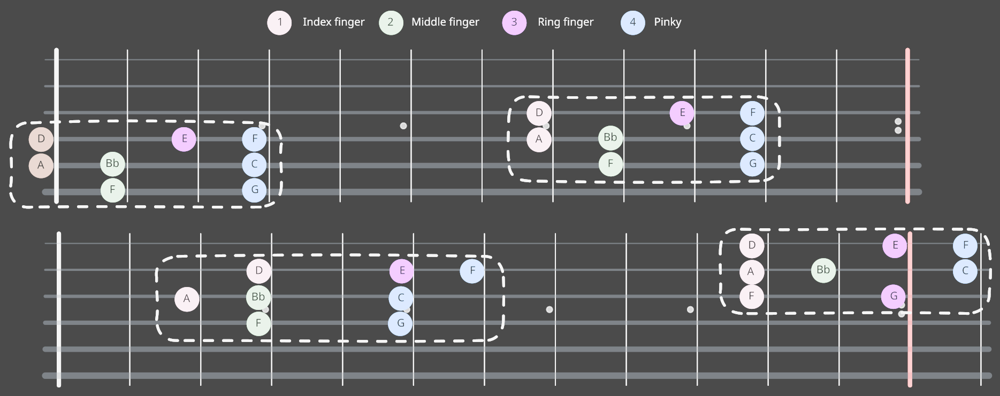

- TOC
{:toc}

> N'appuie pas trop fort sur les cordes (ne serre pas le manche avec ton pouce)

> Calle tes doigts contre les frets

> Respecter du mieux possible les doigts utilisés

> Faire des aller-retour avec le mediator

> Tu peux tester avec plein d'autres tonalités :P

---

# Triton

- Choisir une note
- Trouver son triton superieur
- Trouver son triton inferieur
- Eviter de se faire avoir par l'intervale different entre la corde de Sol et Si 

# Octave

- Choisir une note
- La retrouver sur tout le manche
> S'aider du triton permet de capter le truc

# Quarte et quinte

---

# Major Scales

- Placer les notes de la gamme de **Do majeur** sur la premiere partie du manche 

- De **DO** à **DO**
Retrouver **Do majeur** ailleur en prenant en compte la corde qui n'est pas accordée en quarte

- Pareil avec **Fa majeur** 

- Pareil avec **Sol majeur**

> HF 