- TOC
{:toc}

## Intervalle

Un intervalle est la différence de hauteur entre deux notes — en d’autres termes, la distance qui les sépare. Ce sont les intervalles qui donnent leur forme aux mélodies et leur sonorité aux accords.
On décrit les intervalles de deux façons : par leur tailles (le nombre de notes qui les séparent) et par leur qualité (qui leur confère leur sonorité spécifique, comme majeur, mineur, diminué ou augmenté).

Par exemple, l’intervalle entre le **Do** et le **Mi** s’appelle une *tierce majeure*. On l’appelle *« tierce »* car il couvre trois *degrés* de la gamme (do, ré, mi — degrés 1 à 3), et « majeure » parce que les notes sont séparées de quatre demi-tons, ce qui lui confère une sonorité claire et consonante.

Les intervalles se mesurent en demi-tons : la plus petite distance entre deux notes sur un piano. Un demi-ton correspond à la distance entre une touche et la suivante (noire ou blanche), à la guitare, c'est une case. Deux demi-tons forment un ton.

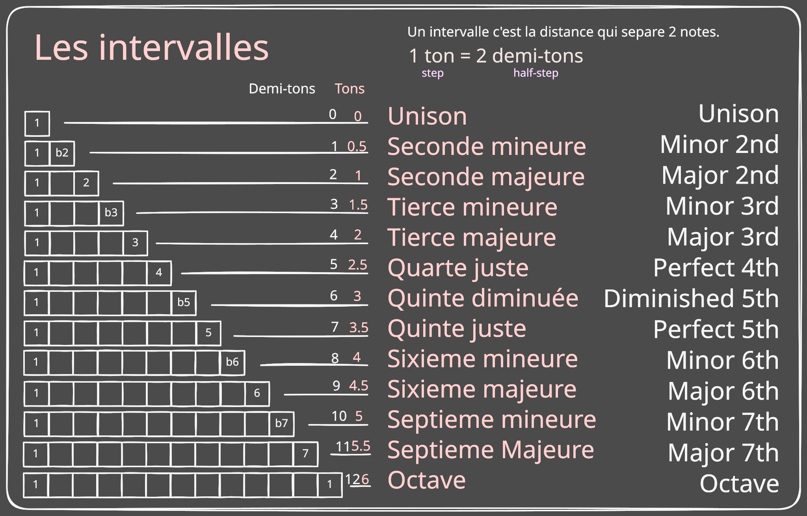

Les notes « naturelles » (Do, Ré, Mi, Fa, Sol, La, Si) correspondent aux touches blanches du piano. Les autres sont des notes altérées : un dièse (♯) monte la note d'un demi-ton, un bémol (♭) la descend d'un demi-ton. Une même note peut donc avoir deux noms (Do♯ = Ré♭).

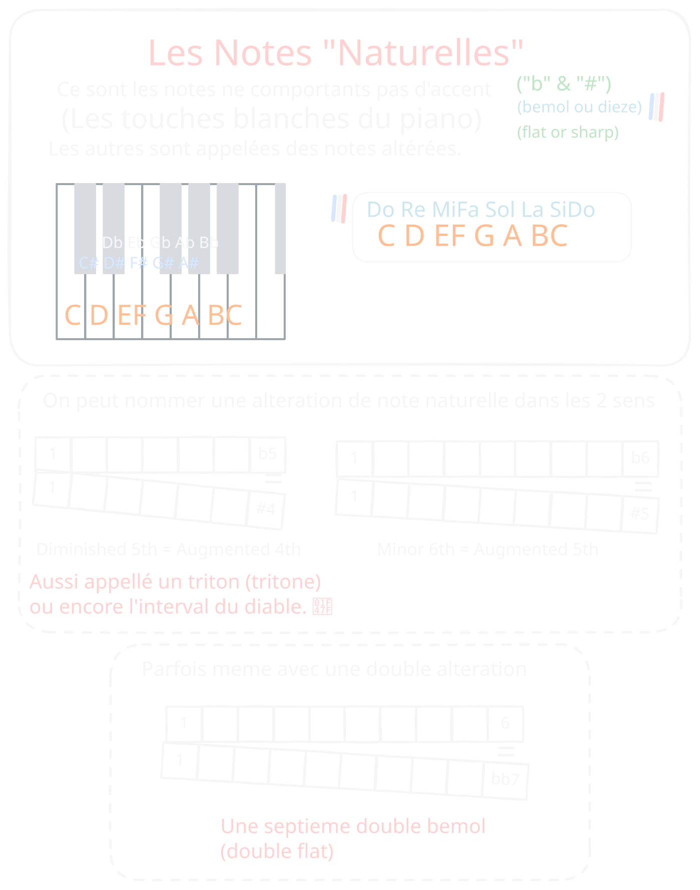

> Une corde de guitare, c'est comme un clavier de piano où toutes les touches (blanches comme noires) sont identiques : une case = un demi-ton. 

>Les cordes sont en plus décalées les unes par rapport aux autres, comme des claviers empilés en décalés. Sur le manche, rien ne distingue les notes altérées : il faut apprendre à les repérer

Voici comment placer les notes sur la guitare :

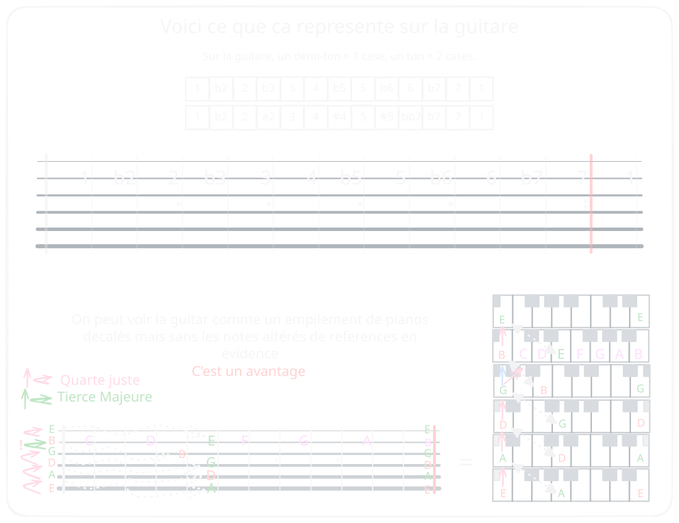

 
Questions ?

🎯 À toi de jouer

📝 Combien de demi-tons y a-t-il dans une tierce mineure ? une quarte juste ? une quinte juste ? une sixte majeure ? une septième mineure ?

📝 Quelle note se trouve un demi-ton au-dessus de Mi ? Et au-dessus de Si ?

🎸 Prends la corde de La à vide et monte case par case jusqu'à la case 12, en nommant chaque note à voix haute. Que se passe-t-il à la case 12 ?

 
Réponses

📝 3, 5, 7, 9 et 10 demi-tons.

📝 Fa et Do : il n'y a pas de note altérée entre Mi et Fa, ni entre Si et Do.

🎸 La, La♯/Si♭, Si, Do, Do♯/Ré♭, Ré, Ré♯/Mi♭, Mi, Fa, Fa♯/Sol♭, Sol, Sol♯/La♭, puis La à la case 12 : c'est la même note, une octave plus haut.

## Gammes

Une gamme est un ensemble de notes qui sert de base aux mélodies aux accords. La plus connue est la **gamme majeure** : sept notes qui suivent un schéma spécifique d’intervalles (écarts entre les notes). Ce schéma lui donne sa sonorité claire et familière, utilisée dans d’innombrables chansons.

> **La gamme majeure est notre référence.** Tous les intervalles sont nommés par rapport à elle. 

Depuis la première note (la fondamentale, degré 1), les degrés 2, 3, 6 et 7 forment des intervalles majeurs, et les degrés 4, 5 et 8 des intervalles justes. Les autres s'obtiennent en ajoutant ou en retirant un demi-ton : mineur = majeur − 1 demi-ton ; diminué = juste − 1 demi-ton ; augmenté = juste (ou majeur) + 1 demi-ton.

Degrés : 1 2 34 5 6 71

Voici la gamme majeure, avec le nombre de demi-tons entre chaque note. Au piano, on l'obtient en jouant uniquement les touches blanches. Entre deux notes consécutives, il y a un ton (2 demi-tons), sauf entre Mi et Fa et entre Si et Do, où il n'y a qu'un demi-ton. Au total : 5 tons et 2 demi-tons, soit 12 demi-tons.

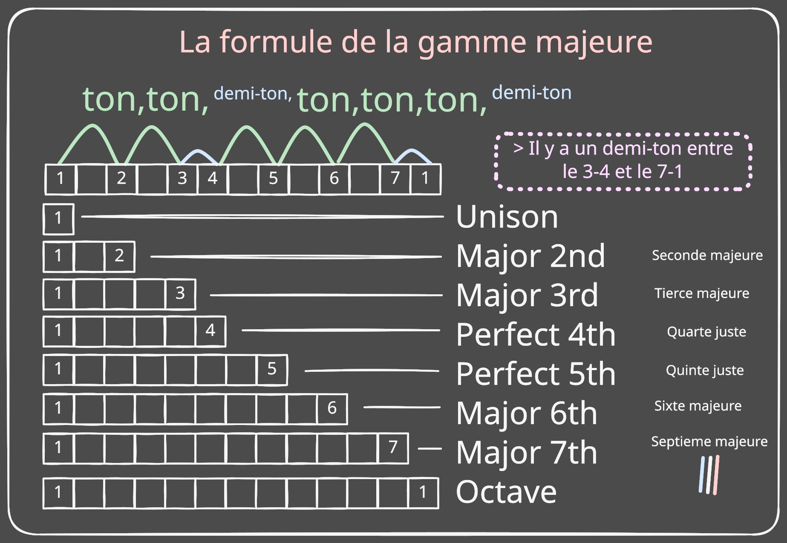
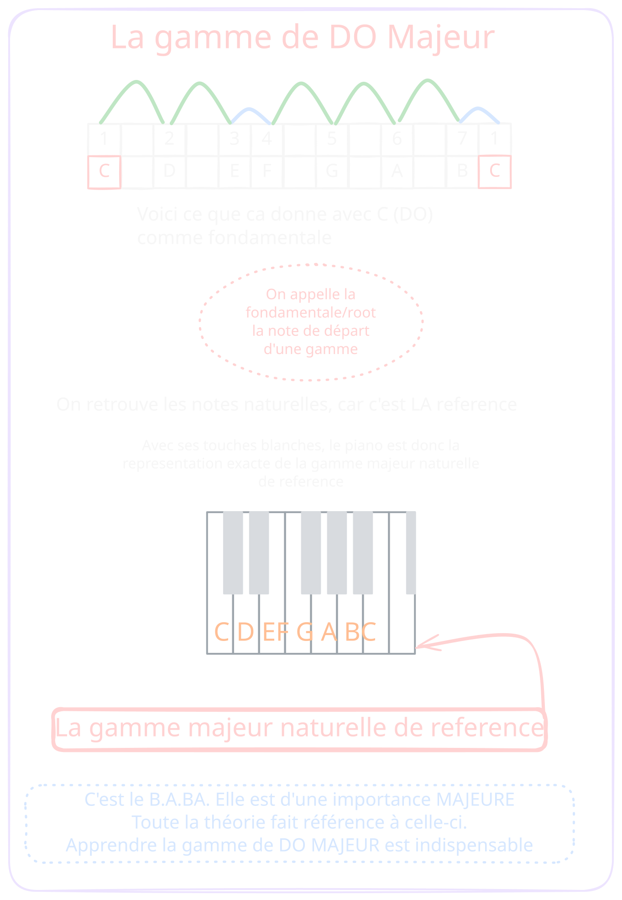
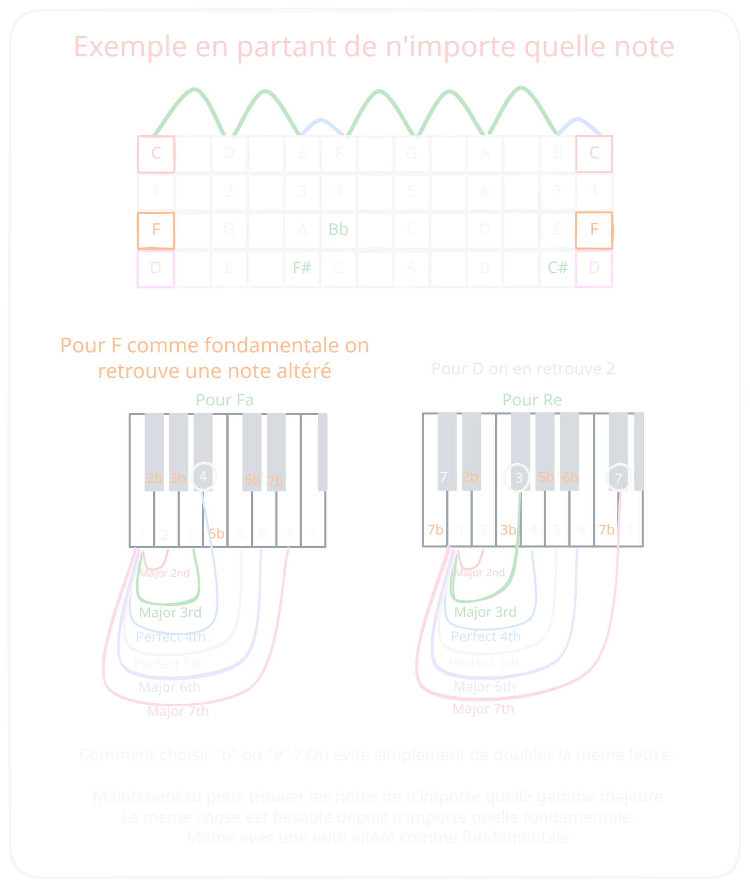
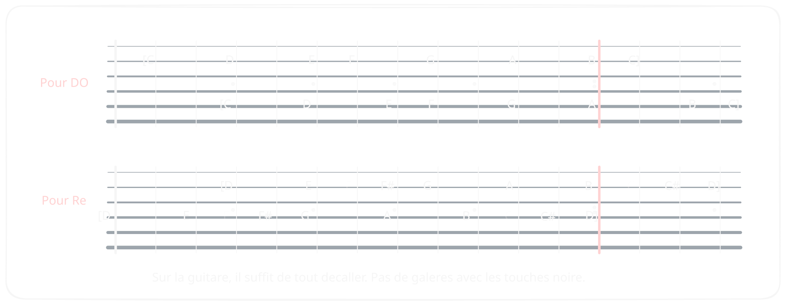

Tu peux construire une gamme majeure à partir de n'importe quelle note. Elle garde la même formule d'intervalles que Do majeur, mais commence ailleurs. Pour conserver cette formule, il faut parfois altérer certaines notes (♭ ou ♯) : Fa majeur contient un Si♭, Ré majeur un Fa♯ et un Do♯. Pour choisir entre ♭ et ♯, une règle simple : on évite de répéter la même lettre dans la gamme (on écrit Si♭ et non La♯ pour Fa majeur, car La est déjà présent).

Si ya un truc a retenir c'est le patern : TON,TON,demi-ton,TON,TON,TON,demi-ton

🎯 À toi de jouer

 
Questions ?

📝 Écris la gamme de Sol majeur avec la formule. Quelle note est altérée ?

🔥 Défi : décale cette même forme de 2 cases (départ case 5). Quelle gamme joues-tu ?

🔥 Défi : écris la gamme de Si♭ majeur. Combien de notes sont altérées ?

 
Réponses

📝 Sol – La – Si – Do – Ré – Mi – Fa♯ : seul le Fa est altéré.

🔥 Ré majeur (Ré – Mi – Fa♯ – Sol – La – Si – Do♯), cases 5, 7, 9, 10, 12, 14, 16, 17.

🔥 Si♭ – Do – Ré – Mi♭ – Fa – Sol – La : deux notes altérées (Si♭ et Mi♭).

## Intervalle en detail

### Unison
Deux notes identiques forment un unisson : 0 demi-ton, même hauteur. À la guitare, une même note existe à plusieurs endroits du manche. Par exemple, la note de la case 5 de la corde de Mi grave est la même que la corde de La à vide.
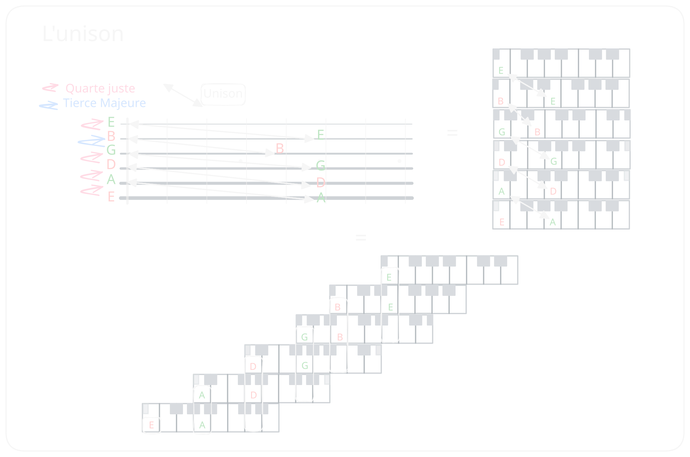
> Pas de prise de tete, spammer la meme note en boucle, c'est spammer nos oreilles d'unisons

### L'octave
Un octave c'est 6 tons  / 12 demi-tons

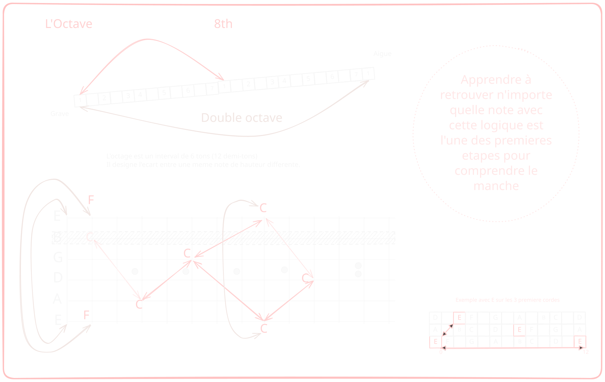

 
Questions ?

🎯 À toi de jouer

🎸 Joue le Sol à vide (corde de Sol). Retrouve ce même Sol sur les autres cordes.

🎸 Joue le Do de la corde de La (case 3). Retrouve son octave avec la règle « deux cordes plus aiguës, deux cases plus loin ».

🔥 Défi : joue le Ré de la corde de Ré à vide, puis trouve son octave sur la corde de Si. De combien de cases faut-il se décaler, et pourquoi ?

 
Réponses

🎸 Corde de Ré case 5, corde de La case 10, corde de Mi grave case 15.

🎸 Corde de Sol, case 5.

🔥 3 cases (corde de Si, case 3). Entre Sol et Si, les cordes sont espacées d'un demi-ton de moins que d'habitude (4 au lieu de 5), donc il faut une case de plus pour compenser.

### Le triton
> `Triton` = `Quarte augmentée` = `Quinte diminuée`

Le triton est un intervalle de 3 tons (6 demi-tons), d'où son nom. Sa sonorité est dissonante et instable. On l'appelait autrefois « l'intervalle du diable ».

Ces trois noms désignent le même écart de 6 demi-tons, mais on choisit le nom selon la façon d'écrire la note. De Do à Fa♯, on traverse quatre notes (Do, Ré, Mi, Fa) : c'est une quarte augmentée. De Do à Sol♭, on en traverse cinq : c'est une quinte diminuée. Le son est le même, l'écriture change.

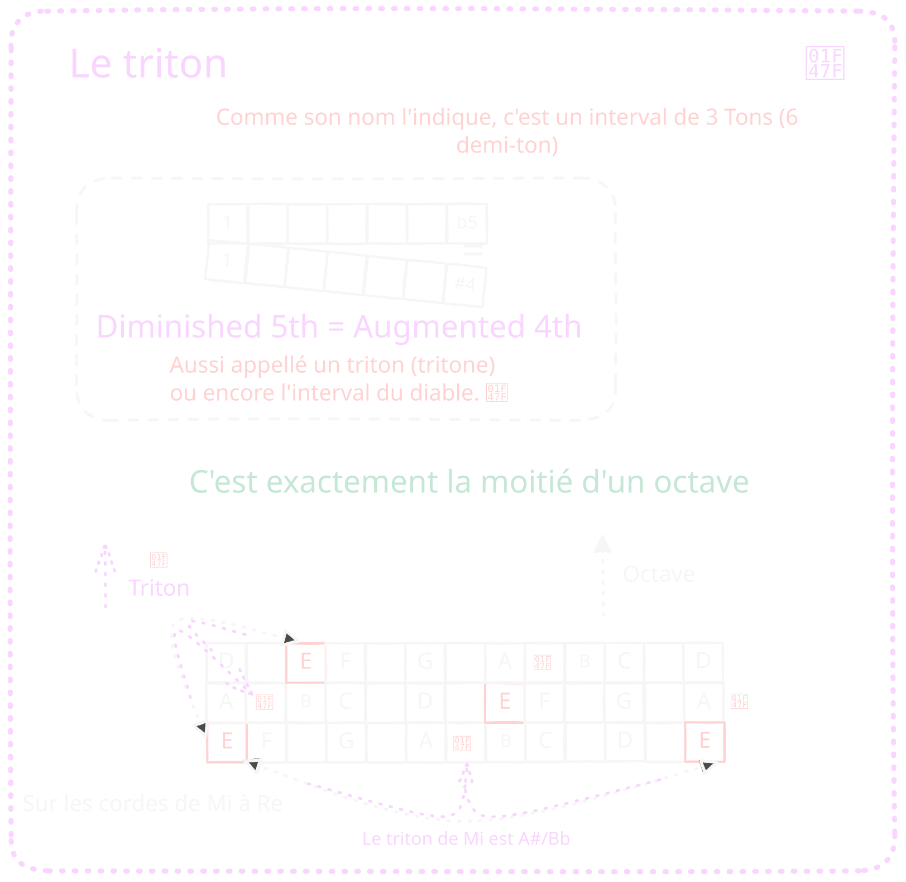

> ⚠️ Astuce de repérage : le triton est exactement la moitié d'une octave (6 + 6 = 12 demi-tons). Deux tritons à la suite te ramènent à la note de départ, une octave plus haut.

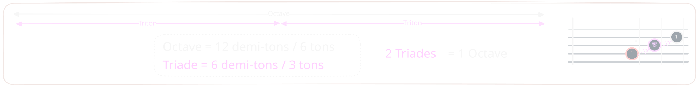

> [Voir les exercices sur la géométrie du manche.](../exercices/1/1.exo.md)

Le triton se place entre la quarte juste et la quinte juste :
un demi-ton de moins que le triton (5 demi-tons), c'est une quarte juste ;
un demi-ton de plus que le triton (7 demi-tons), c'est une quinte juste.

 
Questions ?

🎯 À toi de jouer

📝 Quel est le triton de Do ? de Mi ? de Si ?

📝 Dans la gamme de Do majeur, quelles deux notes forment un triton ?

🎸 Joue la corde de La à vide, puis la case 6 de la même corde. Retrouve cette note sur la corde de Ré. Quelle règle observes-tu entre deux cordes voisines ?

 
Réponses

📝 Fa♯ (ou Sol♭), La♯ (ou Si♭), Fa.

📝 Fa et Si (degrés 4 et 7). C'est le seul triton de la gamme majeure.

🎸 Case 1 de la corde de Ré (Ré♯/Mi♭). D'une corde à la corde aiguë voisine, le triton se trouve une case plus loin (deux cases entre Sol et Si).

### La quarte juste | Perfect Fourth

La quarte juste fait 5 demi-tons (2,5 tons). La guitare est accordée en quartes : Mi – La – Ré – Sol – Si – Mi (E A D G B E). Entre deux cordes voisines, il y a 5 demi-tons (5 cases), à une exception près :

> Entre la corde de Sol (G) et la corde de Si (B), l'écart n'est que d'une tierce majeure (4 demi-tons).

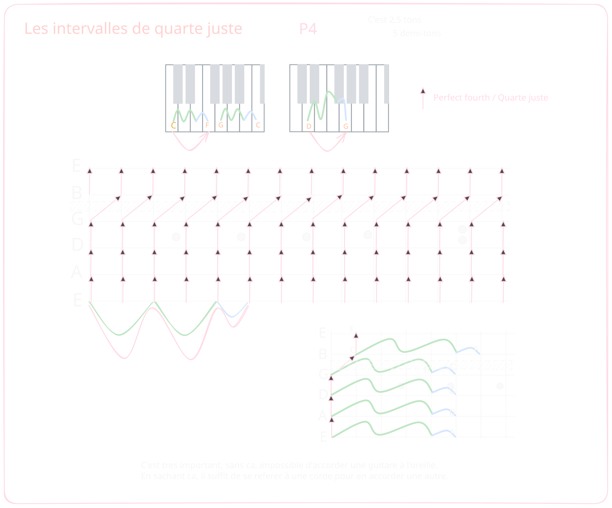

### La quinte juste | Perfect Fifth

La quinte juste fait 7 demi-tons (3,5 tons). Elle complète la quarte : quarte + quinte = octave (5 + 7 = 12). Sur le manche, on la trouve sur la corde aiguë voisine, 2 cases plus loin (3 cases entre Sol et Si).

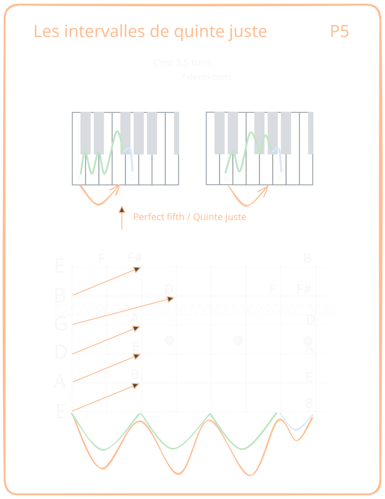

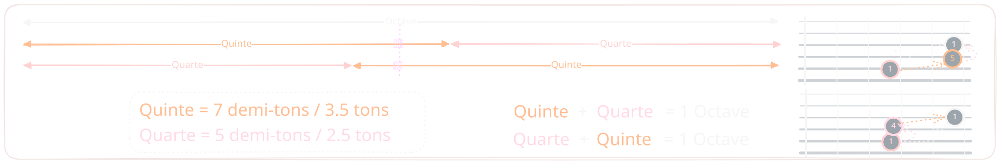

 
Questions ?

🎯 À toi de jouer

📝 Donne la quarte juste et la quinte juste au-dessus de Do, de Fa et de Si.

🎸 Joue le Sol de la corde de Mi grave (case 3). Trouve sa quinte juste avec la règle des « 2 cases plus loin ».

🔥 Défi : pars du Do de la corde de La (case 3). Monte d'une quinte, puis d'une quarte. Où arrives-tu ?

 
Réponses

📝 Do : Fa et Sol. Fa : Si♭ et Do. Si : Mi et Fa♯.

🎸 Corde de La, case 5 : c'est un Ré.

🔥 Quinte : Sol (corde de Ré, case 5), puis quarte : Do (corde de Sol, case 5). Tu retombes sur le Do, une octave plus haut.

### Les tierces | Third

On appelle « tierce » deux intervalles différents :

- la tierce majeure (3) : 2 tons, soit 4 demi-tons ;
- la tierce mineure (b3) : 1,5 ton, soit 3 demi-tons.

La tierce mineure est une tierce majeure resserrée d'un demi-ton. C'est elle qui donne aux accords mineurs leur couleur plus sombre, alors que la tierce majeure donne aux accords majeurs une couleur plus lumineuse (on y revient dans la partie suivante).

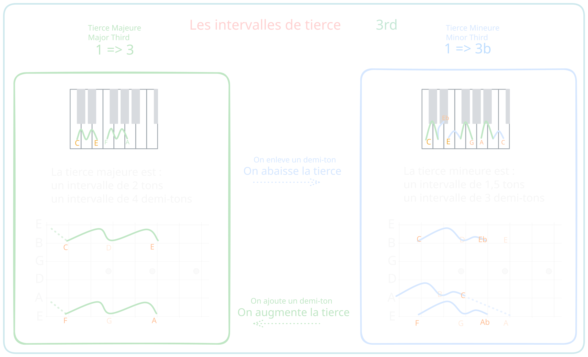

 
Questions ?

🎯 À toi de jouer

📝 Donne la tierce majeure et la tierce mineure au-dessus de Do, de La et de Sol.

🎸 Joue le Do de la corde de La (case 3), puis la case 7, puis la case 6. Laquelle des deux notes sonne la plus lumineuse ? La plus sombre ?

🔥 Défi : empile une tierce majeure et une tierce mineure. Quel intervalle obtiens-tu ? Et dans l'autre ordre ?

 
Réponses

📝 Do : Mi et Mi♭. La : Do♯ et Do. Sol : Si et Si♭.

🎸 La case 7 (Mi, tierce majeure) est la plus lumineuse. La case 6 (Mi♭, tierce mineure) est la plus sombre.

🔥 Une quinte juste dans les deux cas : 4 + 3 = 3 + 4 = 7 demi-tons.

## L'accordage de la guitare 

### Comment accorder sa guitare 

Les cordes à vide, de la plus grave à la plus aiguë, sont : Mi – La – Ré – Sol – Si – Mi (E A D G B E).

Pour entraîner ton oreille, accorde la 6e corde (le Mi grave) avec un accordeur, puis sers-t'en pour accorder la suivante : appuie sur la case 5 de la corde déjà accordée, elle doit sonner comme la corde voisine à vide. Répète de corde en corde. Une seule exception : pour accorder le Si à partir du Sol, appuie sur la case 4.

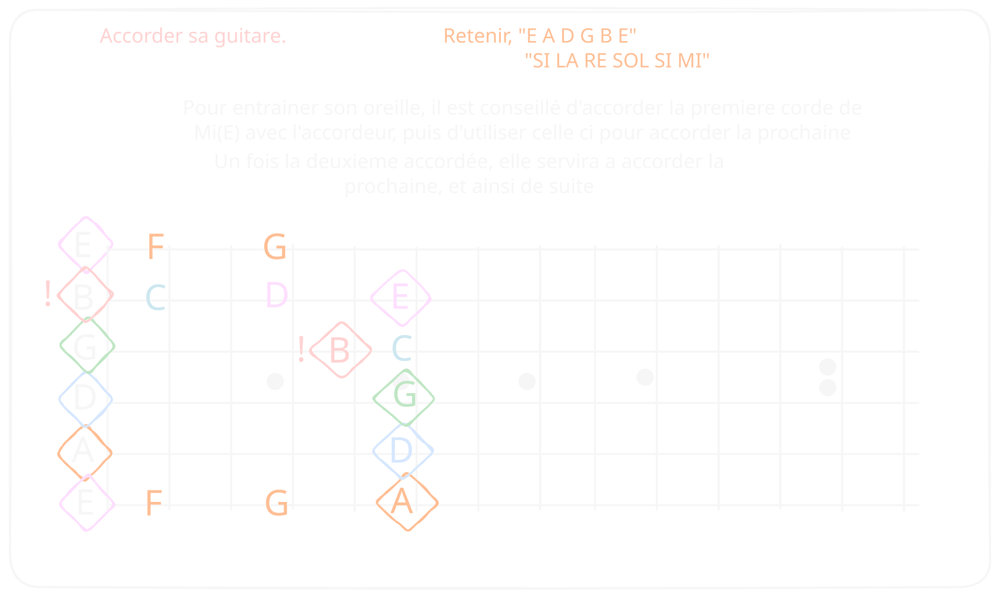

### L'accordage est en quarte sauf 

> Entre la corde de Sol (G) et la corde de Si (B), l'intervalle est une tierce majeure, c'est-à-dire une quarte juste moins un demi-ton.

Pourquoi cette exception ? C'est un compromis. Si toutes les cordes étaient accordées en quartes, les formes d'accords majeurs et mineurs les plus courantes seraient plus étirées et moins confortables pour la main gauche. Resserrer l'écart entre Sol et Si d'un demi-ton les rend plus faciles à jouer.

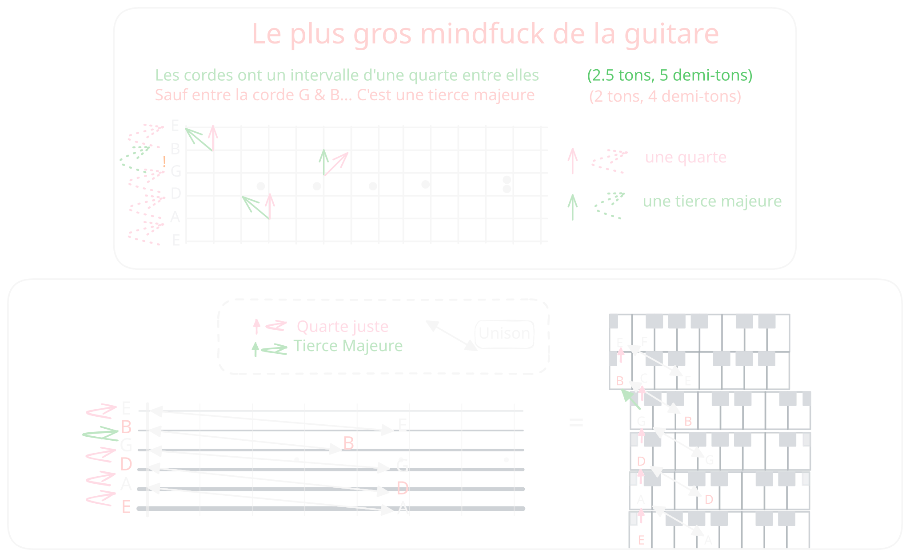

Show Image

 
Questions ?

🎯 À toi de jouer

🎸 Accorde ta guitare avec la méthode de la case 5. Pourquoi faut-il appuyer sur la case 4, et non 5, pour passer du Sol au Si ?
🔥 Défi : abaisse la corde de Mi grave d'un ton pour obtenir un Ré (accordage « Drop D »). Vérifie deux choses : à vide, elle sonne une octave sous la corde de Ré ; case 7, elle sonne comme la corde de La à vide. Quel intervalle est-ce, case 7 ? Tu peux ensuite la remonter en Mi.

 
Réponses

Parce que Sol → Si est une tierce majeure (4 demi-tons) et non une quarte juste (5 demi-tons).
Du Ré au La, il y a 7 demi-tons : une quinte juste.

## Les complements d'intervalles

Le complément d'un intervalle (on parle aussi de renversement) est ce qui lui manque pour faire une octave. Si tu montes d'un intervalle, puis de son complément, tu retombes sur la même note, une octave plus haut : les deux intervalles font toujours 12 demi-tons à eux deux.

seconde ↔ septième ; tierce ↔ sixte ; quarte ↔ quinte ;
majeur ↔ mineur ; juste ↔ juste ; augmenté ↔ diminué (le triton est donc son propre complément).

On peut ainsi retrouver la quarte en reculant d'une quinte, et la quinte en reculant d'une quarte. On peut aussi atteindre la quinte en empilant une tierce majeure et une tierce mineure (ou l'inverse).

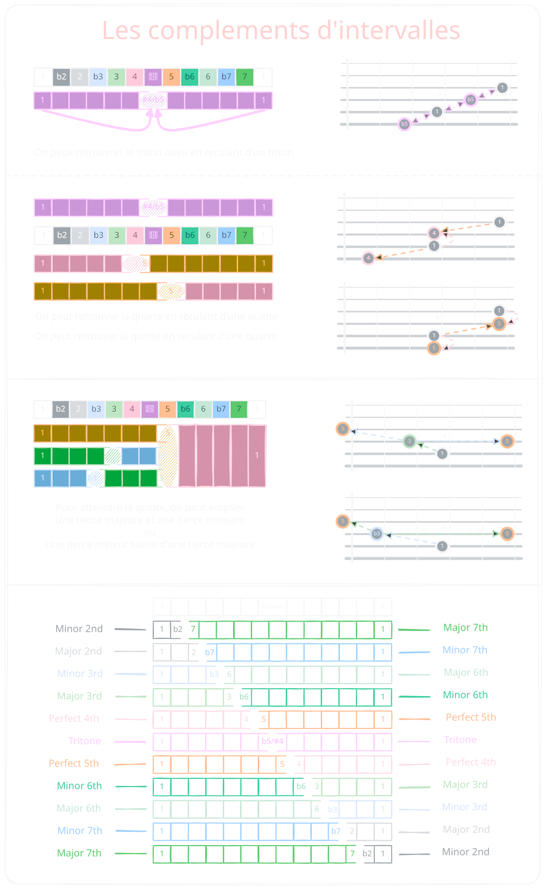

 
Questions ?

🎯 À toi de jouer

📝 Quel est le complément d'une tierce majeure ? d'une quarte juste ? d'une septième mineure ? du triton ?
🔥 Défi : pars du Do, monte d'une tierce mineure, puis d'une sixte majeure. Où arrives-tu ?

 
Réponses

📝 Sixte mineure (4 + 8 = 12), quinte juste, seconde majeure (10 + 2 = 12), triton.
🔥 Do (3 + 9 = 12) : Do → Mi♭ → Do à l'octave.

---

[Next](../part2){: .btn }